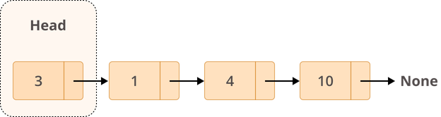

## Linked List
A linked list is a linear data structure in which the items get stored at random memory locations. Each memory location of a linked list is called a node. These nodes are linked together using pointers.

Since the items are at random locations, we need to store the address of the next item in the current node. Hence, each node contains two fields; a data value to store the data of the current node and a pointer that stores the address of the next node.

The last node of the linked list contains a pointer that points to NULL. The head is a pointer that keeps a reference to the first element of a linked list.

Each element of a linked list is called a node, and every node has two different fields:

- 1. Data contains the value to be stored in the node.
- 2. Next contains a reference to the next node on the list.
Here’s what a typical node looks like:

#### A linked list is a collection of nodes. The first node is called the head, and it’s used as the starting point for any iteration through the list. The last node must have its next reference pointing to None to determine the end of the list. Here’s how it looks:

